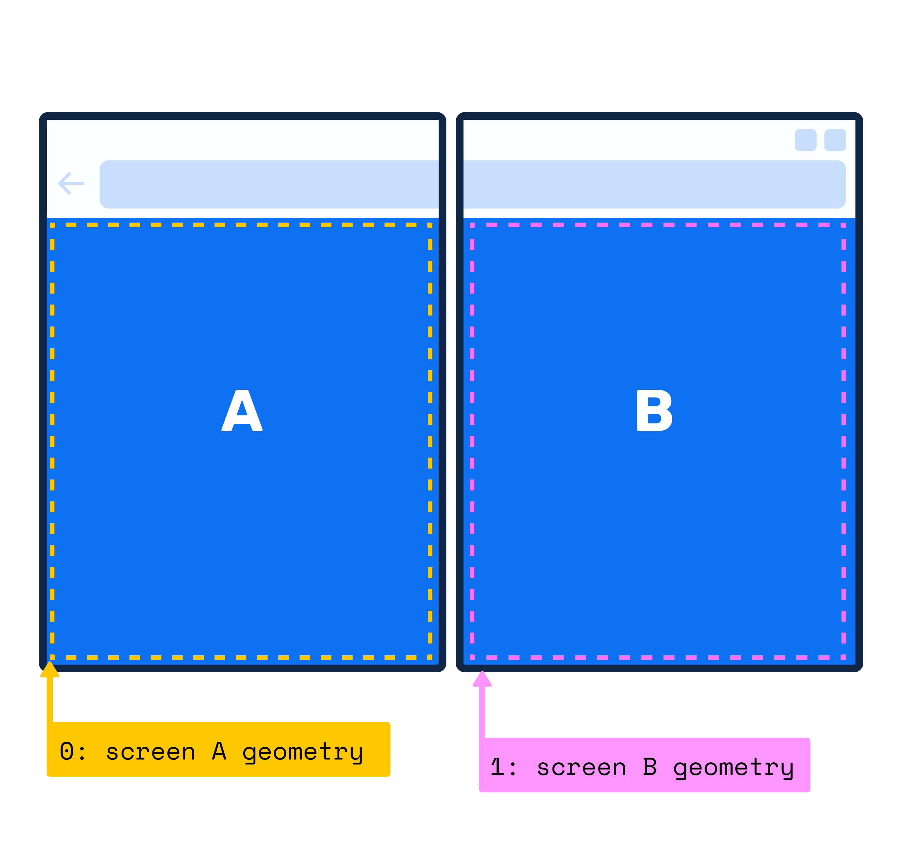

Window Segments Enumeration API polyfill
===

This is a polyfill for the [proposed](https://github.com/MicrosoftEdge/MSEdgeExplainers/blob/master/Foldables/explainer.md) JavaScript screen segments enumeration API for foldable and dual-screen devices.

Web developers targeting foldable devices want to be able to effectively lay out the content in a window that spans multiple displays. In some cases such as Canvas context or very unpredictable layouts, developers will need a JavaScript APIs to learn about available screens, their segments and natural boundaries.

### The 'getWindowSegments' Window Method

The `getWindowSegments` window method will return an array of screen segments, each segment is an object containing `width`, `height`, `top` and `left` properties (aka segment's bounding rects)



#### Example Usage

```
const screenSegments = window.getWindowSegments();

console.log(screenSegments.length) // 2 in the example above

```

How to use the polyfill
===

Add the polyfill to your project

```html
<script src="window-segments-polyfill.js"></script>
```

and start using the new CSS features.

- That's it. See the `examples/basic` directory for examples.

In order to change the display configuration, you can use the polyfill together with an emulator or you can change the settings manually. The settings are stored across sessions.

#### Manually changing the display configuration

The configuration object is available as

```js
  const config = window["__foldables_env_vars__"];
```

You can update values such as `spanning`, `foldSize` and `browserShellSize` by calling the `update` method:

```js
  config.update({
    spanning: "single-fold-horizontal",
    foldSize: 30,
    browserShellSize: 20
  });
```

Test suite
===

There are unfortunately no [web-platform-tests](https://github.com/w3c/web-platform-tests/) available yet.

Known issues
===

Check GitHub.

Learn more
===

- [Explainer](https://github.com/MicrosoftEdge/MSEdgeExplainers/blob/master/Foldables/explainer.md) - a document explaining how this feature was designed and how it fits together with other APIs.
- [CSS Spanning Media Feature Polyfill](https://github.com/zouhir/spanning-css-polyfill)